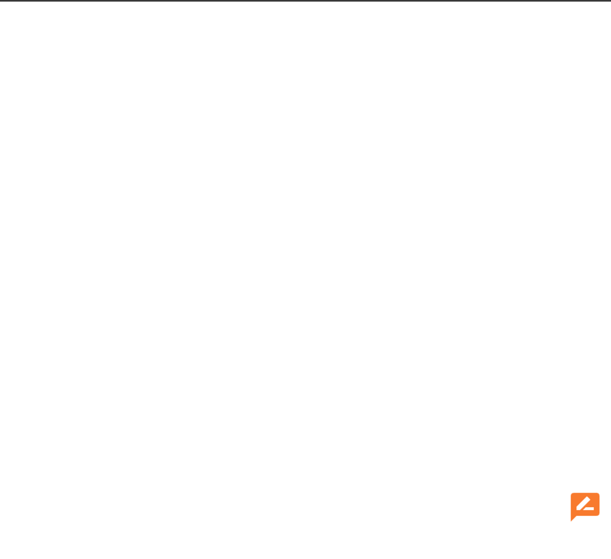
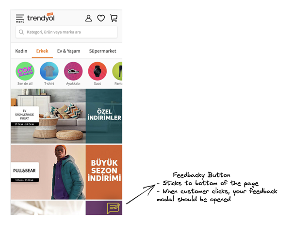
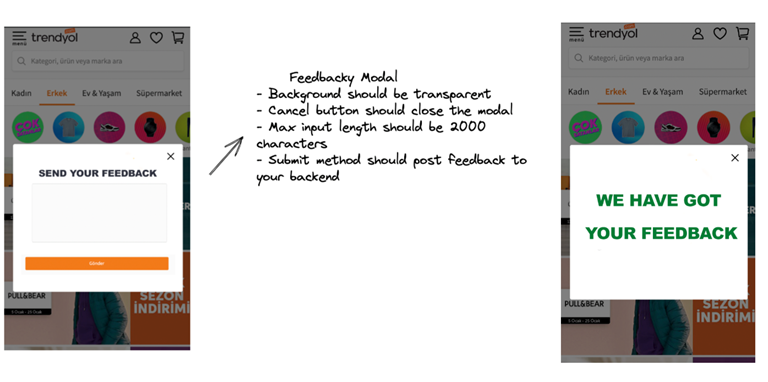

<h1 align="center"> Feedbacky
</h1>
<h2 align="center">
  
</h2>

---

<h4 align="center">
  <a href="#demands">Demands</a>&nbsp;&nbsp;&nbsp;|&nbsp;&nbsp;&nbsp;
  <a href="#information_source-about">About</a>&nbsp;&nbsp;&nbsp;|&nbsp;&nbsp;&nbsp;
  <a href="#rocket-technologies">Technologies</a>&nbsp;&nbsp;&nbsp;|&nbsp;&nbsp;&nbsp;
  <a href="#seedling-minimal-requirements">Requirements</a>&nbsp;&nbsp;&nbsp;|&nbsp;&nbsp;&nbsp;
  <a href="#beginner-getting-started">Getting Started</a>&nbsp;&nbsp;&nbsp;|&nbsp;&nbsp;&nbsp;
</h4>

## :demands: Feedbacky Demands

Let’s imagine that you’ve decided to build a start-up and that you have a great idea, which is a feedback system that enables customers to give feedback on e-commerce websites. You are both the founder and technical chief of your startup.

So, let’s start building your startup!

**Here are the Acceptance Criteria:**

- You don’t have access to your clients’ code base
- Your client-side code should be easily integrable
- You should show your client’s feedback in a simple HTML table or on a Google Sheet File
- Expected code coverage is 100%
- You can use any tech stack which you feel comfortable with

Your first customer is Trendyol, and you can reach Trendyol’s expectations on the images below: 

**Nice to have topics that could help your possible client to buy your service:**

- An online demo 
- Well documented product 
- Dealing with security concerns 
- Bug free and 100% unit test coverage
- Well performanced client side library
- Responsive Design
- Clean code and readable folder structure

**PS:** Please include **"case is done"** in your last commit.

### Follow Us!

[Trendyol Tech Medium](https://medium.com/trendyol-tech)

[Trendyol Open Source GitHub](https://github.com/Trendyol)

[Trendyol Tech Youtube](https://www.youtube.com/channel/UCUBiayLMggBAsiYvGLzQJ5w)

[Trendyol Tech Kommunity](https://kommunity.com/@trendyol)

### :information_source: About

Feedbacky app developed for both side. tdd aproach about will come here

## :rocket: Technologies

The project was developed using the following technologies:

- [JavaScript](https://www.javascript.com/)
- [Node.js](https://nodejs.org/)
- [React](https://reactjs.org/)
- [Jest](https://jestjs.io/)
- [Mongo Db](https://www.mongodb.com/)
- [ESLint](https://eslint.org/)

## :seedling: Minimal Requirements

- [Node v10+](https://nodejs.org/en/docs/)
- [NPM](https://www.npmjs.com/) or [Yarn](https://classic.yarnpkg.com/en/docs/).

## :beginner: Getting Started

<b>Cloning the repository:</b>

- `$ git clone https://github.com/abdullahsuhaisk/Tdd-Todo.git`

<b>Download the dependences:</b>

This project has 3 projects inside of it

Every step has own install.You can follow regular installation or docker

### :link: Regular Installation
<b>For Front-End</b>
-`cd frontend`
- `npm install`
- `npm start && npm test`

<b>For Back-End</b>
-`cd todo-backend`
- `npm install`
- `npm start && npm test`

<b>For E2e test</b>
-`cd frontend`
- `npm install`
- `npm test:e2e`

 For run test go specs folder open todo.spec -> press run spec on left corner 

 

