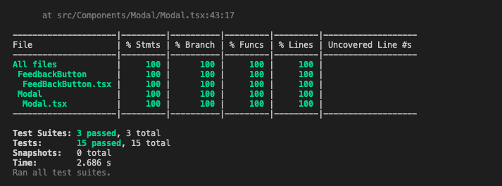
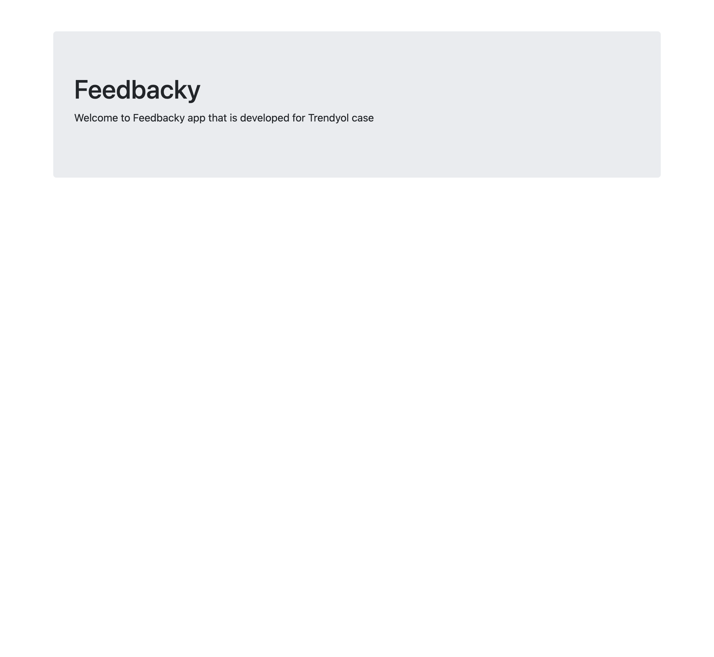
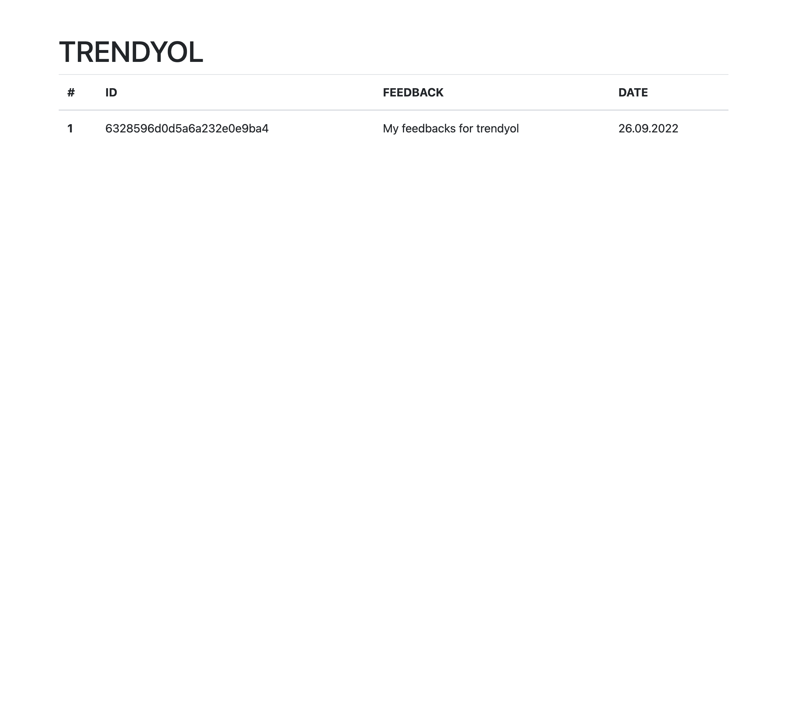

<h1 align="center"> Feedbacky
</h1>
<h2 align="center">
  
</h2>

---

<h4 align="center">
  <a href="#receip-Feedbacky-Demands">Feedbacky Demands</a>&nbsp;&nbsp;&nbsp;|&nbsp;&nbsp;&nbsp;
  <a href="#information_source-about">About</a>&nbsp;&nbsp;&nbsp;|&nbsp;&nbsp;&nbsp;
  <a href="#wrench-Integration">Integration</a>&nbsp;&nbsp;&nbsp;|&nbsp;&nbsp;&nbsp;
  <a href="#rocket-technologies">Technologies</a>&nbsp;&nbsp;&nbsp;|&nbsp;&nbsp;&nbsp;
  <a href="#seedling-minimal-requirements">Requirements</a>&nbsp;&nbsp;&nbsp;|&nbsp;&nbsp;&nbsp;
  <a href="#beginner-getting-started">Getting Started</a>&nbsp;&nbsp;&nbsp;|&nbsp;&nbsp;&nbsp;
</h4>

## :receipt: Feedbacky Demands

Let’s imagine that you’ve decided to build a start-up and that you have a great idea, which is a feedback system that enables customers to give feedback on e-commerce websites. You are both the founder and technical chief of your startup.

So, let’s start building your startup!

**Here are the Acceptance Criteria:**

- You don’t have access to your clients’ code base
- Your client-side code should be easily integrable
- You should show your client’s feedback in a simple HTML table or on a Google Sheet File
- Expected code coverage is 100%
- You can use any tech stack which you feel comfortable with

Your first customer is Trendyol, and you can reach Trendyol’s expectations on the images below: 

**Nice to have topics that could help your possible client to buy your service:**

- An online demo 
- Well documented product 
- Dealing with security concerns 
- Bug free and 100% unit test coverage
- Well performanced client side library
- Responsive Design
- Clean code and readable folder structure

**PS:** Please include **"case is done"** in your last commit.

### Follow Us!

[Trendyol Tech Medium](https://medium.com/trendyol-tech)

[Trendyol Open Source GitHub](https://github.com/Trendyol)

[Trendyol Tech Youtube](https://www.youtube.com/channel/UCUBiayLMggBAsiYvGLzQJ5w)

[Trendyol Tech Kommunity](https://kommunity.com/@trendyol)

## :information_source: About

This project was developed for Trendyol Case. Acceptance criteria is above. I tried to apply all requirements. The project is divided into two pieces, these are front-end and back-end.  Detailed package information is given below section.

### Front-End
I used React and developed React Web Widget because that is the easiest way for customer-side integration. The app is covered by unit tests and end-to-end tests. The app provided a feedback icon and feedback modal. I tried to apply the TDD approach and used Typescript. I served the CDN JavaScript file and CSS file.

`https://trendyolcase1.herokuapp.com/main.js`
`https://trendyolcase1.herokuapp.com/main.css`

### Back-End
The back-end app is developed via NodeJS and ExpressJS. It deployed in Heroku(only the backend). Which helps the CDN process with static file serving service. I used EJS for serving company feedback. That helped a simple and good shape table.

https://trendyolcase1.herokuapp.com/

https://trendyolcase1.herokuapp.com/feedback/trendyol

When your development is done, you have to run `npm build`. That command

## :rocket: Technologies

The project was developed using the following technologies:

- [JavaScript](https://www.javascript.com/)
- [Node.js](https://nodejs.org/)
- [Express.js](https://expressjs.com/)
- [React](https://reactjs.org/)
- [Jest](https://jestjs.io/)
- [Mongo Db](https://www.mongodb.com/)
- [Puppeteer](https://pptr.dev/)
- [Ejs](https://ejs.co/)

## :seedling: Minimal Requirements

- [Node v10+](https://nodejs.org/en/docs/)
- [NPM](https://www.npmjs.com/) or [Yarn](https://classic.yarnpkg.com/en/docs/).

## :beginner: Getting Started

<b>Cloning the repository:</b>

- `$ git clone https://github.com/DevelopmentHiring/SuhaIsik`

<b>Download the dependences:</b>

This project has 2 projects inside of it

Every step has own install.You can follow regular installation 

### :link: Regular Installation
<b>For Front-End</b>  
- `cd frontEnd/feedbackyfe`
- `npm install`
- Run: `npm start `
- Coverage: `npm run coverage`
- Unit Test: `npm test`
- End To End Test: `npm test:e2e`

<b>For Back-End</b>  
- `cd backend`
- `npm install`
- Run: `npm start `
- Unit Test: `npm test`

## :wrench: Integration

The integration process is very easy. You need to import feedbacky's JS and CSS files and define a single div element with a selected `feedbacky-widget` ID.
`https://trendyolcase1.herokuapp.com/main.js`
`https://trendyolcase1.herokuapp.com/main.css`
The app is going to find the element and render it inside. The Feedbacky button sticks to the bottom of the page and modal overlays all pages.
`data-subreddit` attribute defines your company id.

Example usage;
`

`

Example Html file
`
    <!DOCTYPE html>
    <html lang="en">
    <head>
      <meta charset="UTF-8">
      <meta http-equiv="X-UA-Compatible" content="IE=edge">
      <meta name="viewport" content="width=device-width, initial-scale=1.0">
      <title>Document</title>
    </head>
      <body>
       
       <link rel="stylesheet" href="https://trendyolcase1.herokuapp.com/main.css">
       

       <!-- YOUR CODES HERE -->
    </body>
    </html>
`

For the live example, Please open example.html on root.
